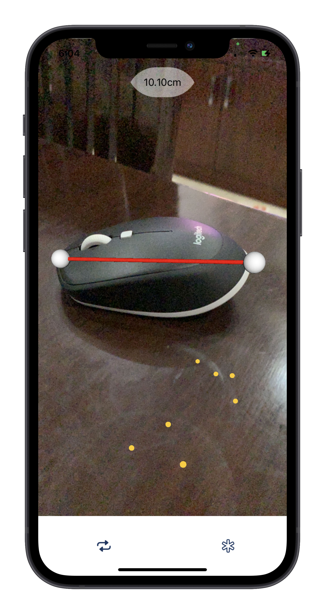
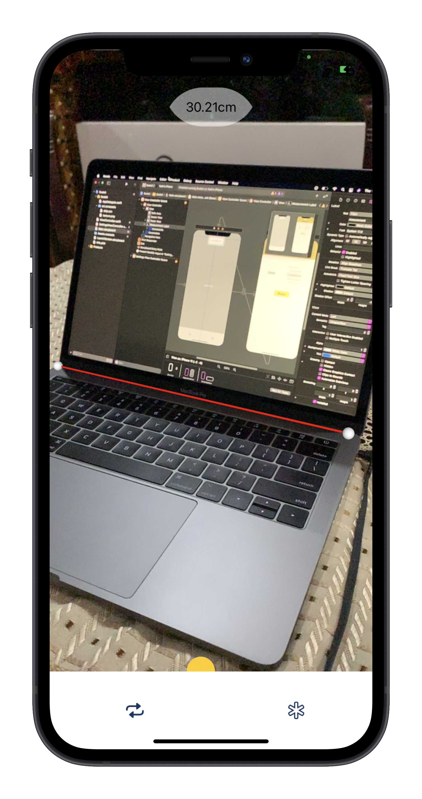
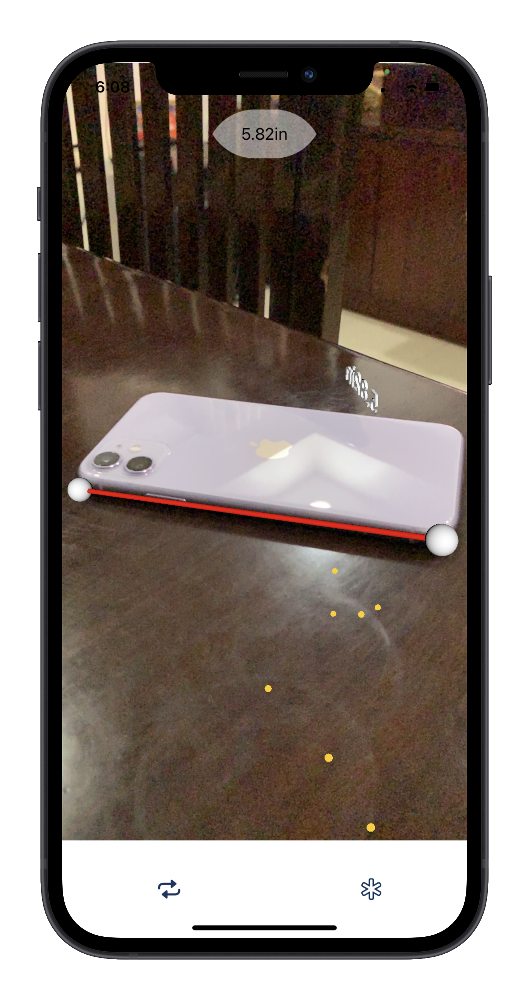
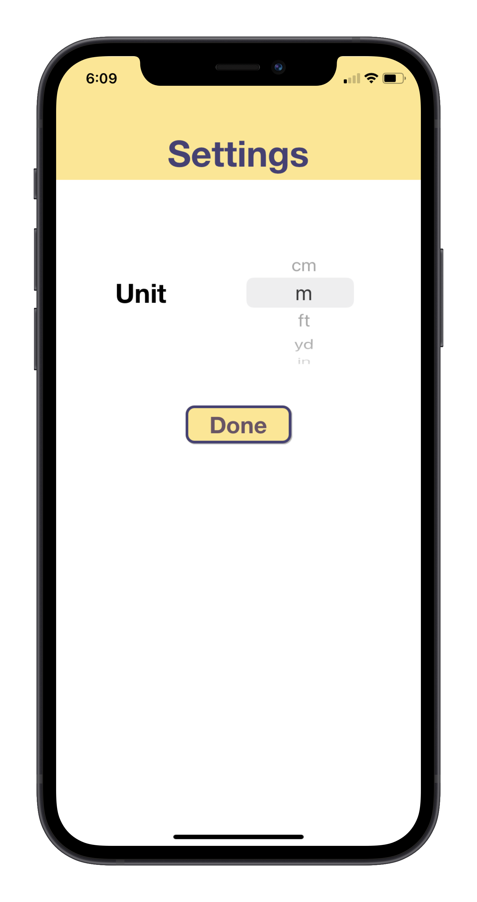

# ScaleIt
A simple AR measure app for iOS and iPadOS made using Apple's ARKit in Xcode.

The app returns the distance between two points, tap on the starting and ending point of the object you want to measure. The app also provides various measuring units to choose from.

 &nbsp;&nbsp;&nbsp;&nbsp;&nbsp;&nbsp; &nbsp;&nbsp;&nbsp;&nbsp;&nbsp;&nbsp;
 &nbsp;&nbsp;&nbsp;&nbsp;&nbsp;&nbsp;
# Installation
* Download or clone the repository to Xcode and run the project in Xcode. 
* Change the Signing & Capabilties and change the Bundle Identifier. 
* Since the app requires actual physical device, make sure you have ARKit compatible device. 
* Finally run the app on your device. Enjoy :smile:.

## License
[MIT](https://choosealicense.com/licenses/mit/)

